# LAB-21079: Contact Center Enterprise (CCE) Observability with Splunk and ThousandEyes

## 1. Before you begin

### 1.1 Prerequisites

* Access to the session Topology page so you can read the Splunk DNS A record.
* Validate Splunk HEC reachability:

<copy>curl -Iv https://&lt;splunk_fqdn&gt;:8444/services/collector/event</copy>

* Call Flow Script is running to generate the calls.

### 1.2 Values you must collect

Fill this worksheet with customer-specific values. Do not copy tokens or connection strings from the screenshots in this document.

|  |  |
| --- | --- |
| **Item** | **Customer value** |
| **Splunk FQDN (DNS A record)** | Lab example: splunk.cb438.dc-01.com — look up Topology → Info → DNS |
| **Splunk HEC port** | 8444 |
| **Splunk HEC URL** | <copy>https://&lt;splunk_fqdn&gt;:8444/services/collector/event</copy> |

## 2. CCE OpenTelemetry Collector Setup

This part streams Contact Center platform telemetry into Splunk. Complete it before ThousandEyes. Install the Splunk OpenTelemetry Collector on CVP and start it. OpenTelemetry Collector is preinstalled on solution components such as Peripheral Gateway and Router/Logger and VVB .

### 2.1 Install the collector on CVP

1. Sign in to the CVP Windows VM from mRemote on the WKST1 Desktop.
2. Change directory to C:\webexone.
3. Run the Splunk OpenTelemetry Collector MSI (**splunk-otel-collector-0.158.0-amd64.msi**).
4. Copy **cvp\_logs.yaml** and **cvp\_metrics.yaml** files from <copy>**C:\webexone\OpenTelemetry Collector**</copy> to <copy>**C:\ProgramData\Splunk\OpenTelemetry Collector**</copy>.
5. Open the cvp\_logs.yaml. Configure HEC Endpoint and Logs to be pushed. [Commented for reference.]
6. Open PowerShell, change to the Desktop and run **start-otel-collector.ps1** [ Check there are two files – make sure you are starting start-otel-collector.ps1]

### 2.2 Start the collector on Peripheral Gateway and Router/Logger

Router/Logger is the combined CCE node often called Rogger. Repeat below steps on each PG and Rogger VM that should send logs.

1. Sign in to the VM [PG, ROGGER] from mRemote on the WKST1 Desktop
2. Open PowerShell and change directory to Desktop (or the folder that contains the start script).
3. Run start-otel-collector.ps1

### 2.3 Start the collector on VVB

1. Sign in to the VVB\_ROOT VM from mRemote on the WKST1 Desktop.
2. From the /root execute <copy>./start-otel.sh</copy>

## 3. Verify CCE logs in Splunk

1. Login to Splunk UI: Open the browser. Click on Demo Links → Splunk. [dclouduser/dcloud@123]
2. Open Search & Reporting application on the left panel.

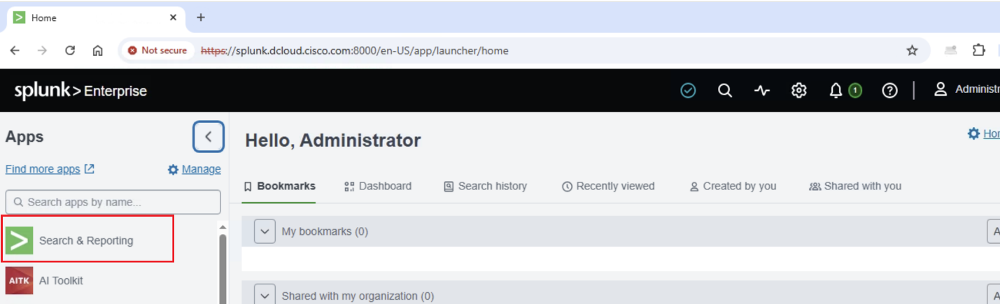

3. Search each component index. Set the time range to at least the last 15 minutes.

|  |  |
| --- | --- |
| **Setting** | **Value to use** |
| **CVP logs** | <copy>index="cvp"</copy> |
| **Peripheral Gateway logs** | <copy>index="pg"</copy> |
| **Router / Logger logs** | <copy>index="router"</copy> |
| **VVB logs** | <copy>index="vvb"</copy> |

**Example:**

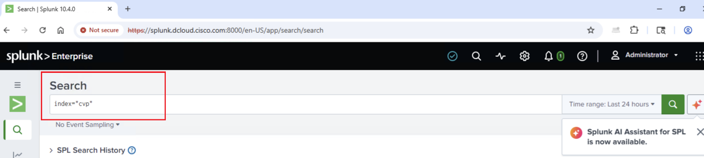

## 4. View logs and the call ladder in the Custom Splunk app.

1. In Splunk, open the CCE Log Collection app (Enterprise Product Control Tower).
2. Click Platform – UCCE Insights.

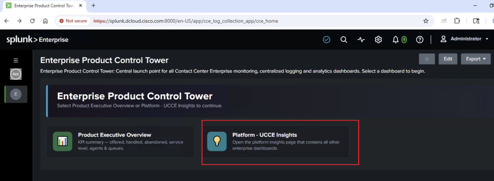

*Figure 1. Enterprise Product Control Tower — open Platform – UCCE Insights to reach log collection, call ladder, and infrastructure dashboards.*

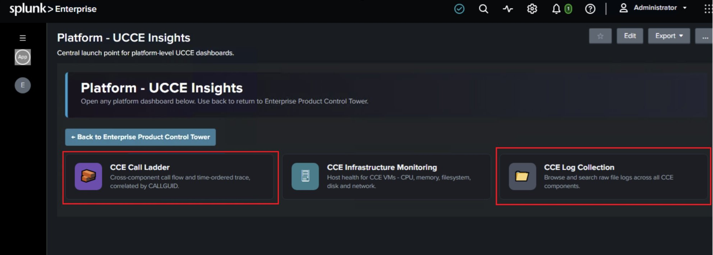

*Figure 2. Platform – UCCE Insights. Use CCE Log Collection for raw file logs and CCE Call Ladder for a CALLGUID-correlated flow.*

3. Open CCE Log Collection. Set Component Type to CVP (or PG, Router, Logger, VVB as needed), then submit.

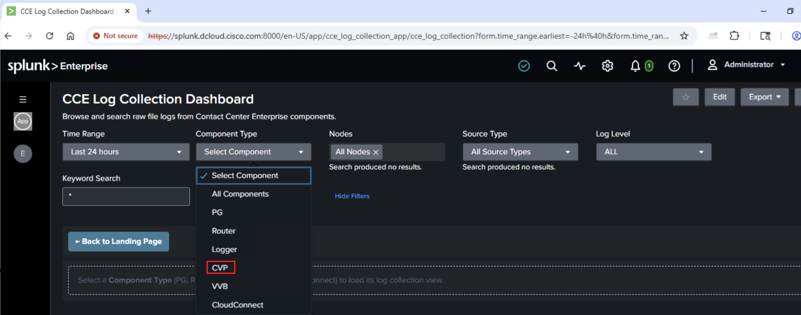

*Figure 3. CCE Log Collection Dashboard — select the CCE component type (CVP shown) to load that component’s log view.*

4. Open CCE Call Ladder from previous page [Click on Back to Landing Page].

Enter a CALLGUID and click Submit to draw the cross-component sequence.

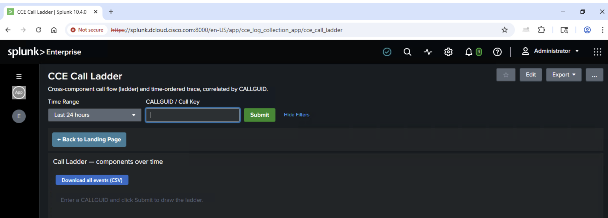

*Figure 4. CCE Call Ladder — correlated by CALLGUID. The ladder is empty until you submit a call identifier.*

## 5. CCE Reporting data to Splunk

Look up the Splunk hostname from the session topology, set the HEC target on the CloudConnect VOS CLI.

1. Open Topology → Info → DNS and find the A record for Splunk.

Example: splunk.cb480.dc-01.com

2. Login to CloudConnect Admin CLI by opening “CLOUDCONNECT” vm in mRemote from WKST1 desktop.
3. Set the Splunk HEC target. Replace the token and hostname with the values from the worksheet:

admin: <copy><i>utils splunk-data-sync splunk-hec set 422f7092-d67c-424b-847a-4e7542236964 &lt;SPLUNK\_FQDN from step1&gt; 8444 https</i></copy>

Example:

admin: utils splunk-data-sync splunk-hec set 422f7092-d67c-424b-847a-4e7542236964 splunk.cb480.dc-01.com 8444 https

Note: After running above CLI, make sure the Splunk HEC configurations are successfully added by running show command. <br>
Eg: <br>
<i>
admin:utils splunk-data-sync splunk-hec show <br>
Note: This may take up to a minute while NiFi is contacted; please wait. <br>
  Connecting to NiFi.... done. <br>
  Reading Splunk HEC configuration.......... done. <br>
Current Splunk HEC configuration: <br>
  Token: 422f7092-d67c-424b-847a-4e7542236964 <br>
  Host: splunk.cb520.dc-05.com <br>
  Port: 8444 <br>
  Protocol: https <br>
  HEC URL: https://splunk.cb520.dc-05.com:8444/services/collector <br>
</i>

Host, Port, Portocol and HEC URL should present like the above example, if not present, retry Step 3.

4. Start the flow service to sync the data from AWDB/HDS to Splunk:

<copy><i>utils splunk-data-sync flow start</i></copy>

5. Sign in to Splunk and open Search & Reporting.
6. Set the time range to Last 15 minutes and run:

<copy><i>index="cce\_rt"</i></copy>

7. Confirm events arrive. If the search is empty, wait one minute and rerun before troubleshooting.

|  |
| --- |
| **Note.** Do not continue to ThousandEyes until index=cce\_rt returns events for the last 5 minutes. |

|  |  |
| --- | --- |
| **Symptom** | **What to check** |
| **f there is an issue with the Splunk connection from Cloudconnect CLI**  **(For the step 3)** | Login to CloudConnect ROOT box. Stop start nifi container.  podman stop nifi  podman start nifi |
| **set command fails** | FQDN matches the Topology DNS A record; port 8444; protocol https; HEC token is valid for this Splunk instance. |
| **flow start fails** | The set command succeeded first; the CLI user is a VOS administrator; retry after correcting HEC settings. |
| **index="cce\_rt" is empty** | Time range is Last 5 minutes; index cce\_rt exists; HEC is reachable from the CCE node; generate CCE activity and wait one minute. |

**5.1 Validate data is populated by executing following query.**

<copy>
index=cce\_config sourcetype=cce:config:call\_type <br>
| stats latest(EnterpriseName) as EnterpriseName latest(CallType) as CallType by CallTypeID <br>
| outputlookup cce\_call\_type\_lookup.csv
</copy>

## 6. ThousandEyes Integration - Verify Access:

Open the ThousandEyes URL on WKST1, then continue in the ThousandEyes portal to install the Endpoint Agent.

1. On the workstation WKST1, open C:\Scripts\TE-URL.txt and copy the URL.

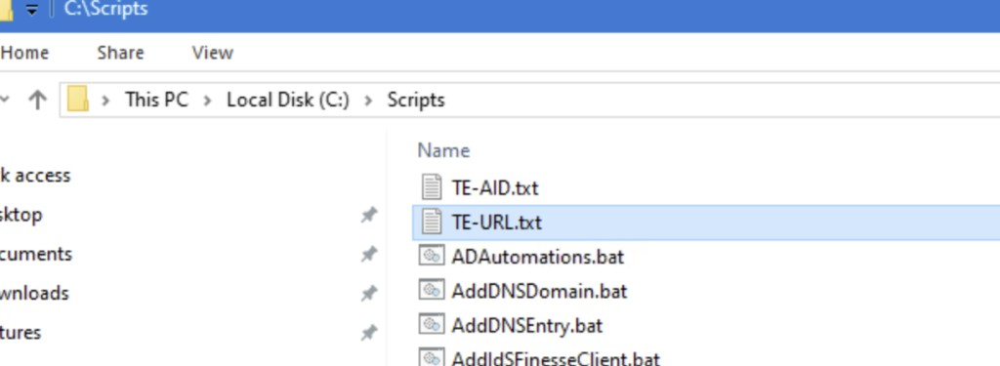

*Figure 1. Lab workstation: C:\Scripts\TE-URL.txt. Open this file and use the URL on your laptop.*

2. Open that URL from browser in WKST1.
3. Then click on Go to account. ThousandEyes should open.

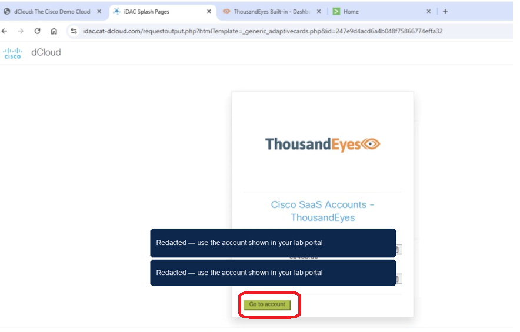

*Figure 2. Click Go to account. Email and user ID are redacted — use the account shown in your own lab portal.*

## 7. Install the Enterprise Agent in CloudConnect

1. Login to ThousandEyes.

2. On the left navigation pane click on Network & App Synthetics → Agent Settings.

3. Click on Add Agent.

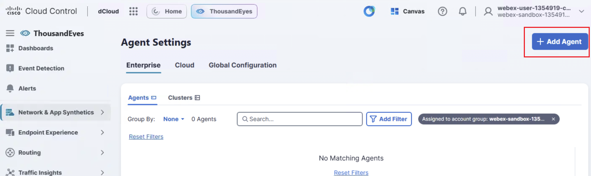

4. Copy the run commands from Linux Package Tab on the opened page as follows,

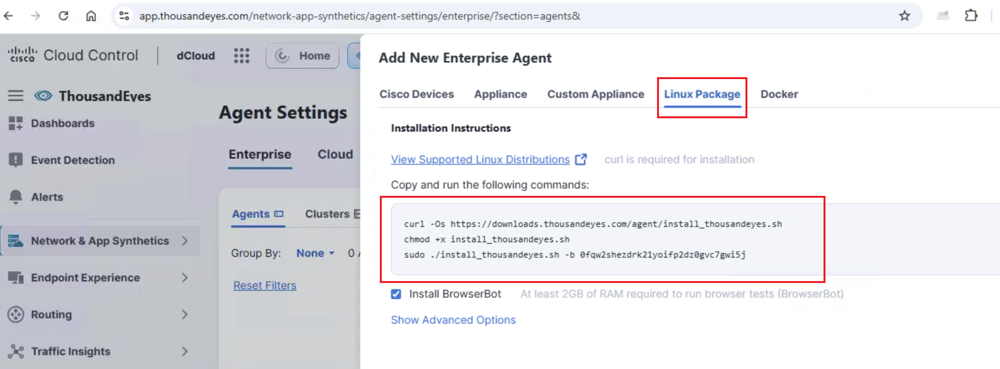

5. Open CLOUDCONNECT\_ROOT VM from mRemote on the WKST1. Execute the commands copied in

step 4.

6. Keep the default log path /var/log.
7. Wait for installation to complete.

!!Do Not Reboot!!

8. Check Agent registered in ThousandEyes and is Online.

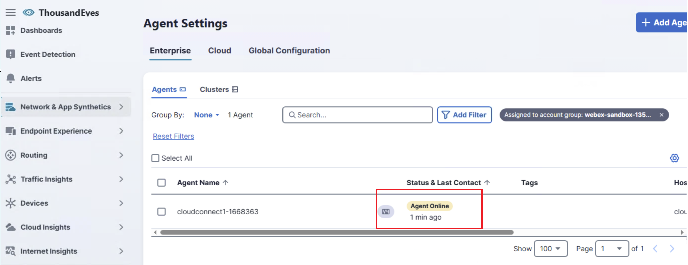

## 8. Create Network Synthetic Test.

1. Log in to ThousandEyes.

2. Click on Network and App Synthetics→ Test Settings→ Add New Test.

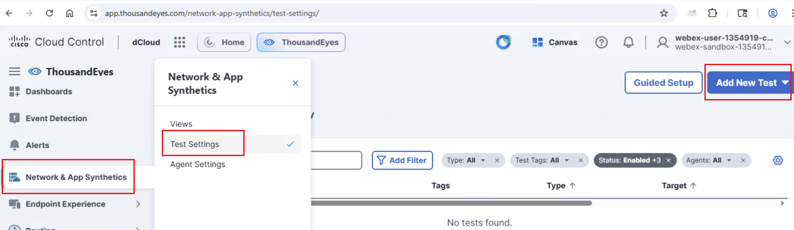

3. Click on HTTP Server

4. Fill the following in opened page.

URL : <copy><http://198.18.133.13:7000/CVP/Server></copy>

Test Name: <copy>CVP-VXML\_Server\_Test</copy>

Select Agent already created.

Example:

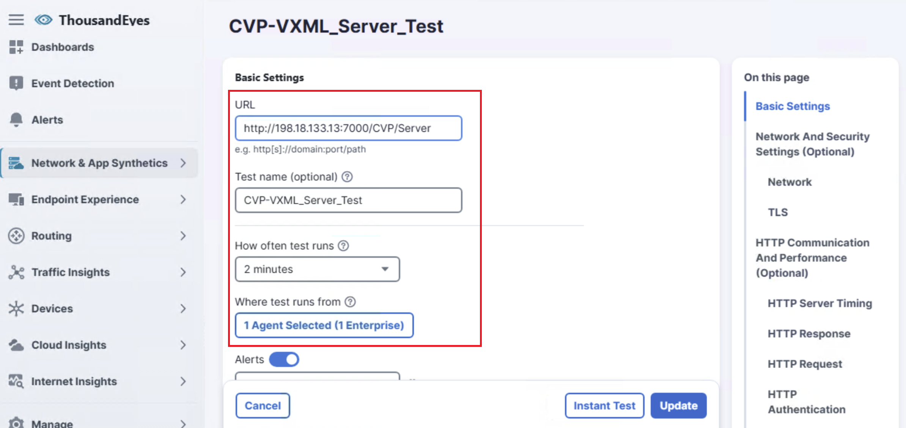

5. Click on Deploy.

6. Check the test results in Network & App Synthetics → Views.  
  
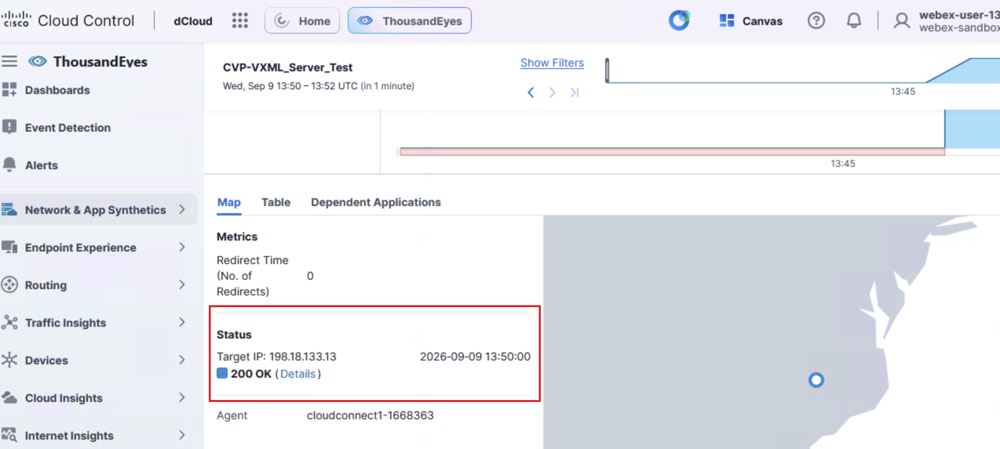

## 9. Connect ThousandEyes to Splunk on Premise

Use Integrations 2.0. Create one Generic Connector to the Splunk HEC endpoint, then two operations on that connector: a native Splunk metrics stream, and a custom webhook for alerts.

### 9.1 Create the Splunk Enterprise Connector and Assign Operation

1. Go to Manage on left navigation pane → Integrations → Integrations 2.0 → Connectors.
2. Click + New Connector → Splunk Enterprise HEC
3. Complete the connector using the table below, then save and assign operations.

|  |  |
| --- | --- |
| **Setting** | **Value to use** |
| **Name** | <copy>Splunk\_TE\_Connector</copy> |
| **Target** | <copy>https://&lt;SPLUNK\_FQDN&gt;:8444/services/collector/event</copy> |
| **Auth type** | Other Token |
| **Token** | <copy>60fb7921-0f4a-48b0-9c27-a2fdd1176cdd</copy> |

Example :

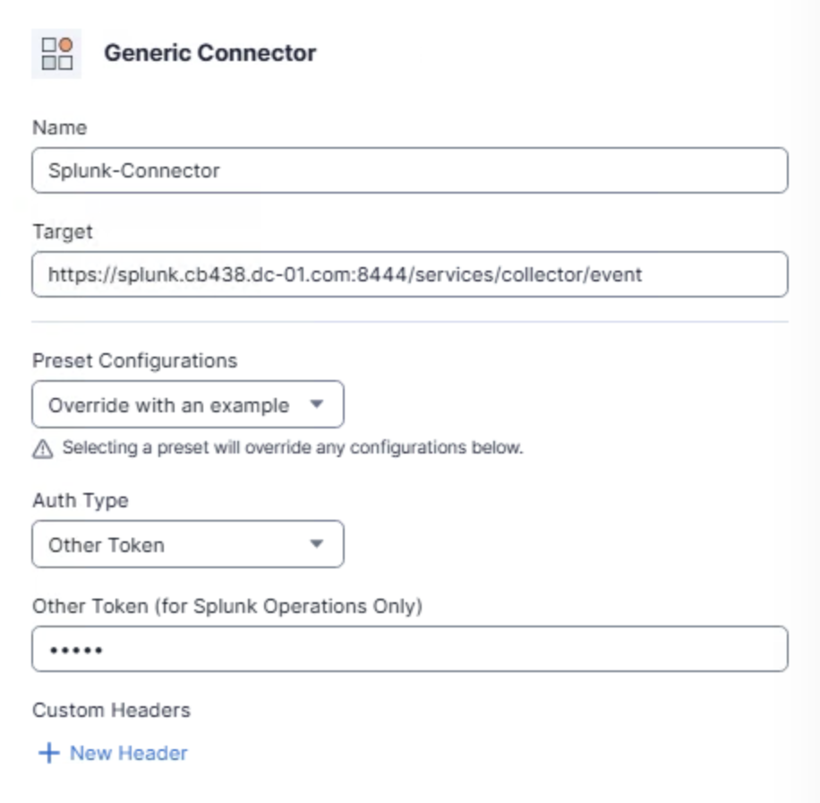

4. From the connector, click + New Operation.
5. Configure the **operation** as follows, click Test, then Save.

|  |  |
| --- | --- |
| **Setting** | **Value to use** |
| **Operation name** | <copy>Splunk\_TE\_Operation</copy> |
| **Index** | <copy>te</copy> (or the customer index) |
| **Source** | <copy>cisco:thousandeyes:stream</copy> |
| **Source type** | <copy>cisco:thousandeyes:metric</copy> |
| **OpenTelemetry signal** | Metrics |
| **Enable** | On |
| **Network & App Synthetics tests** | Select the HTTP / cloud tests that should land in Splunk |

Example: a.

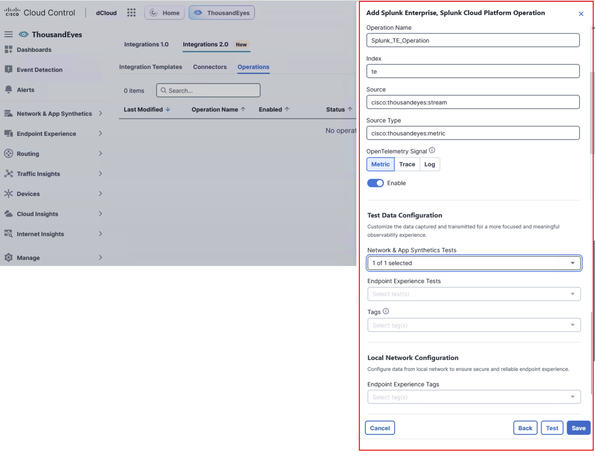

b.

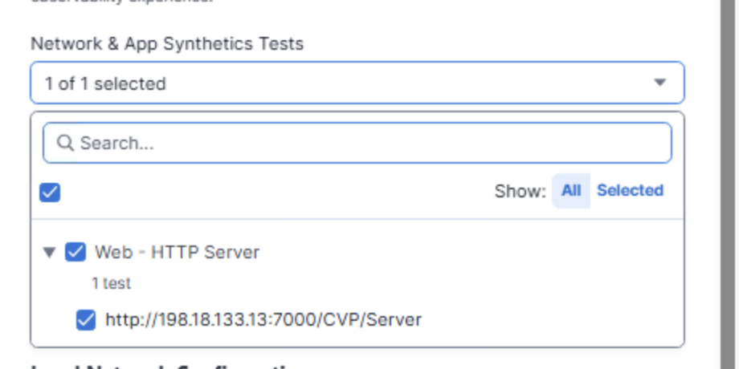

6. Save and click on Test to check Connectivity is successful.

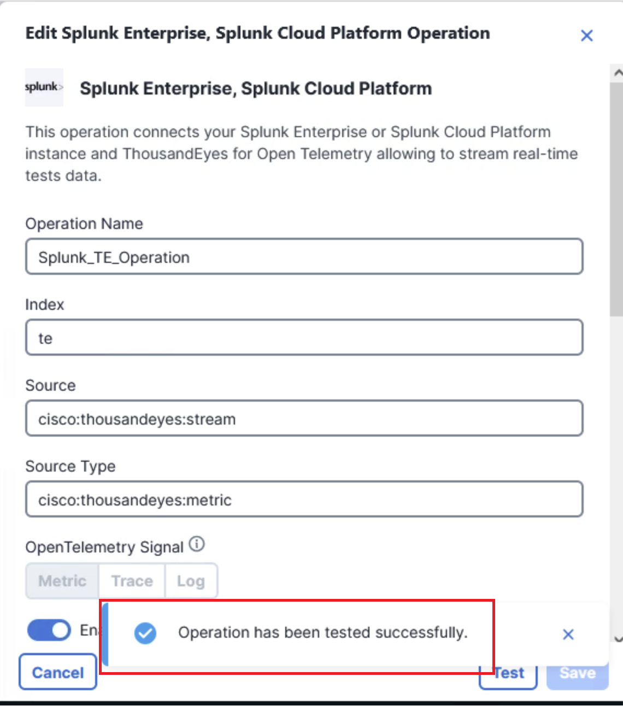

7. Save the Operation

### 9.2 Create the alert webhook operation

1. Go to Manage on left navigation pane → Integrations → Integrations 2.0 → Operations
2. Click + New Operation → Custom Webhook.
3. Name the operation Splunk\_TE\_Webhook (or the customer naming standard).
4. Set Path to **/services/collector/event** so alerts use the same HEC collector as metrics.
5. Add the headers in the table, paste a Splunk HEC JSON body, click Test, then Save.

|  |  |
| --- | --- |
| **Setting** | **Value to use** |
| **Operation name** | <copy>Splunk\_TE\_Webhook</copy> |
| **Path** | <copy>/services/collector/event</copy> |
| **Authorization** | <copy>Splunk 60fb7921-0f4a-48b0-9c27-a2fdd1176cdd</copy> |
| **Content-Type** | <copy>application/json</copy> |
| **Body** | Copy the content of <a href="../assets/payload_body.txt" download="payload_body.txt">payload_body.txt</a> into the body section |

??? note "payload_body.txt (click to expand and copy)"

    
    ```json
    {
        "event": {
            "eventId": "{{id}}-{{alert.id}}",
            "eventType": "THOUSANDEYES_ALERT_NOTIFICATION",
            "id": "{{id}}",
            "type": "{{type.id}}",
            "accountId": "{{alert.rule.account.id}}",
            "orgId": "{{alert.rule.account.organization.id}}",
            {{#if alert.test}}
            "testId": "{{alert.test.id}}",
            "thousandeyes_test_id": "{{alert.test.id}}",
            "test_description": "{{alert.test.description}}",
            "test_type":"{{alert.test.testType}}",
            "itsiDrilldownURI":"https://app.thousandeyes.com/network-app-synthetics/views/?testId={{alert.test.id}}",
            {{/if}}
            "severity_id": "{{#if (eq alert.severity.id 'INFO')}}1{{/if}}{{#if (eq alert.severity.id 'MINOR')}}3{{/if}}{{#if (eq alert.severity.id 'MAJOR')}}5{{/if}}{{#if (eq alert.severity.id 'CRITICAL')}}6{{/if}}",
            "vendor_severity": "{{alert.severity.id}}",
            "app": "THOUSANDEYES",
            {{#if alert.targets.size}}
            "src": "{{#each alert.targets}}{{#if @first}}{{description}}{{/if}}{{/each}}",
            {{/if}}
            "signature":"{{alert.rule.name}}",
            "alert_type":"{{alert.rule.alertType.id}}",
            "alert": {
                "id": "{{alert.id}}",
                "type": "{{alert.rule.alertType.id}}",
                "severity": "{{alert.severity.id}}",
                {{#if alert.test}}
                "test": {
                    "name": "{{alert.test.name}}"
                },
                "targets": [
                    {{#each alert.targets}}
                    "{{description}}"{{#unless @last}}, {{/unless}}
                    {{/each}}
                ],
                {{/if}}
                {{#with alert.rule as | rule |}}
                "rule": {
                    "id": "{{rule.id}}",
                    "name": "{{rule.name}}",
                    "expression": "{{formatExpression rule.expression}}",
                    "notes": "{{rule.notes}}"
                },
                {{/with}}
                "triggered": {{alert.firstSeen.epochMilli}},
                {{#if alert.timeCleared}}
                "cleared": {{alert.timeCleared.epochMilli}},
                {{/if}}
                "details": [
                    {{#each alert.details}}
                        {
                            "metricsAtStart" : "{{metricsAtStart}}",
                            {{#if metricsAtEnd}}
                            "metricsAtEnd" : "{{metricsAtEnd}}",
                            {{/if}}
                            "source" : {
                                "id": "{{source.id}}",
                                "name": "{{source.name}}"
                                {{#if source.asn}}
                                , "asn": "{{source.asn.name}}"
                                {{/if}}
                            }
                        }
                        {{#unless @last}}, {{/unless}}
                    {{/each}}
                ]
            }
        }
    }
    ```
    

Example:

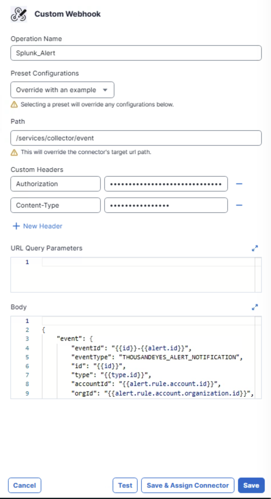

6. Click on Save & Assign Connector.
7. Assign already created connector and save:

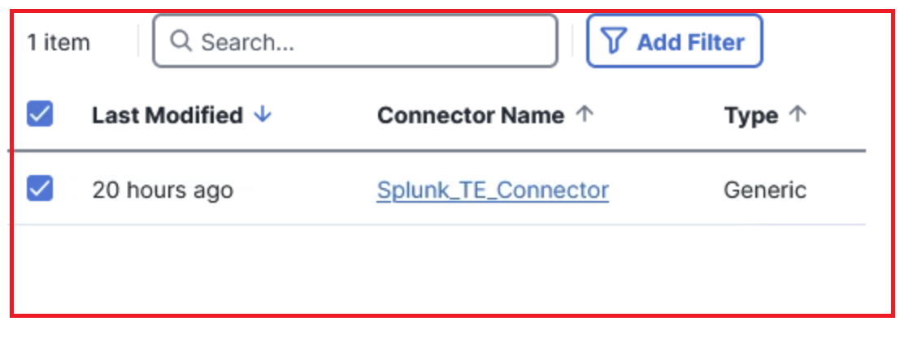

8. Click on the Operation and then Test.
9. Then click on Save.

### 9.3 Confirm both operations are connected state:

1. On Integrations 2.0 → Operations you should see both operations Enabled and Connected on the same Splunk connector.

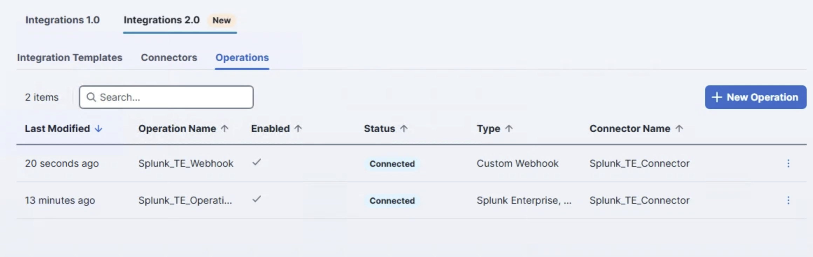

2. Check Splunk is receiving the data from ThousandEyes by executing following search query on Search & Reporting.  
<copy>**index=te sourcetype="cisco:thousandeyes:metric"**</copy>

Example :

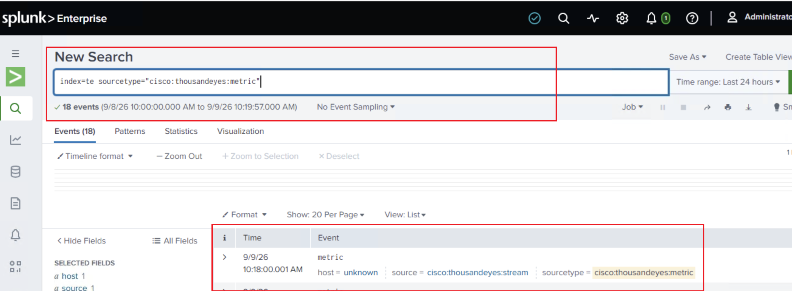

## 10. Configure alert rules.

Use the **default alert rules** that ship with ThousandEyes. Assign the customer’s HTTP and Agent-to-Server tests under Network & App Synthetics, then assign Endpoint tests under Endpoint Experience. [PN: Customer can create Custom Alert Rules also]

**In ThousandEyes, go to Manage → Alerts → Alert Rules.**

### 10.1 Modify default HTTP Alert Rule

1. In ThousandEyes, go to Manage → Alerts → Alert Rules
2. Open the Network & App Synthetics tab. Confirm Default HTTP Alert Rule and Default Network Alert Rule (Agent to Server) are enabled.

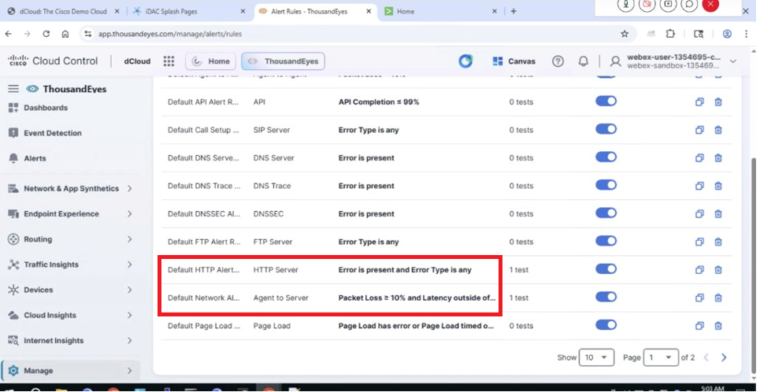

3. Open Default HTTP Alert Rule. On Settings, select the customer HTTP Server test (lab example targets the CVP HTTP check). Save after you confirm the assignment.

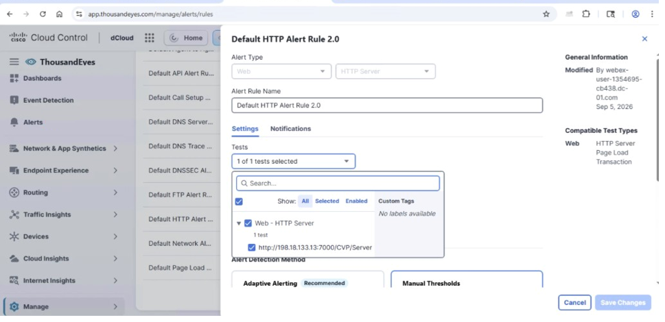

4. On the same HTTP rule, set Alert Detection Method to Manual Thresholds. Trigger when Error is present and Error Type is Any. Save Changes.

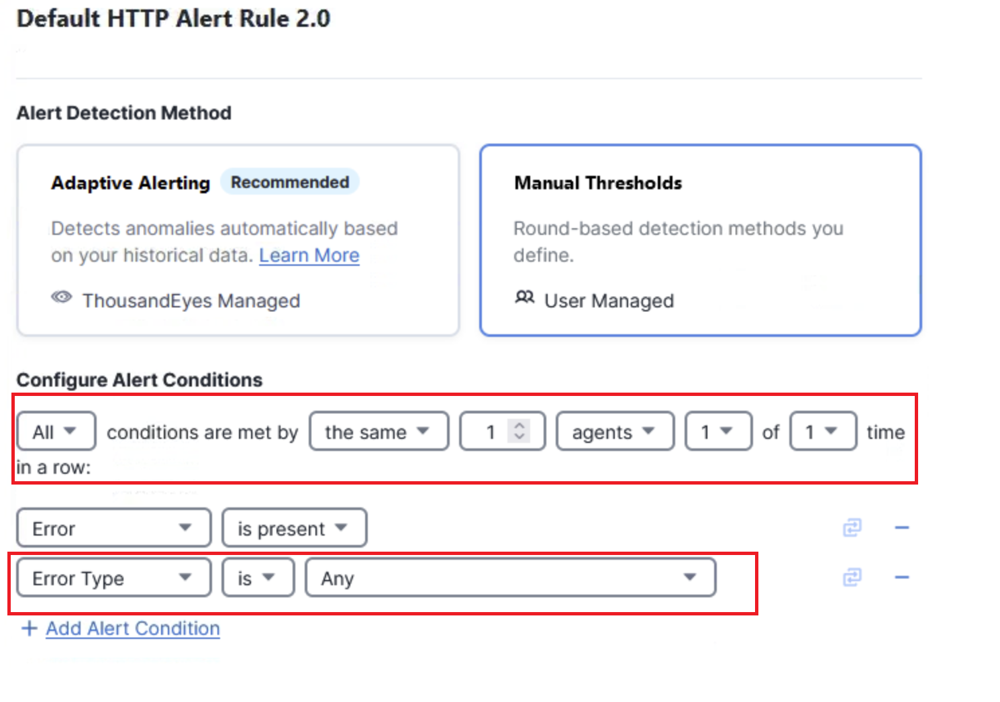

5. Save Changes.

### 10.2 Modify default Network Alert Rule

1. Open Default Network Alert Rule (Agent to Server). Assign the Agent-to-Server / HTTP test that should raise network alerts.

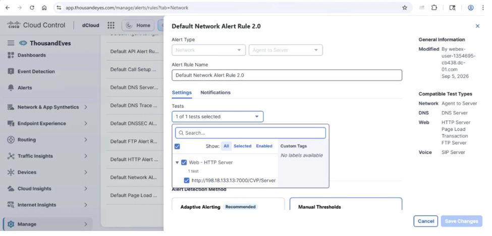

2. Set Manual Thresholds: Packet Loss ≥ 10% and Latency sensitivity High (or the customer’s thresholds). Save Changes.

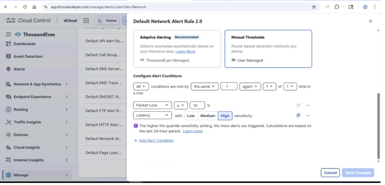

3. Save Changes.

**10.3 View the data and correlation in the custom Splunk Application:**

1. Login to Splunk. Click on **CCE Executive Overview** application on the left side of the home page.

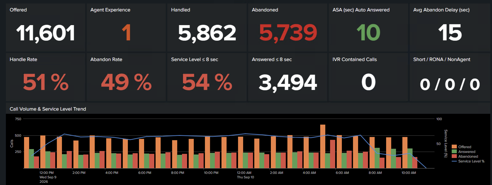

2. Test Call Flow script is running to send calls. User should see the dashboard with call details.
3. Bring down the VXML Server service from the CVP vm.

Login to CVP VM from mRemote. Services→ Cisco CVP VXML Server → Stop Service.

4. ThousandEyes Synthetic test will fail and will trigger the alert. Which will be sent back to Splunk.

On the ThousandEyes login user will see alert as follows,  
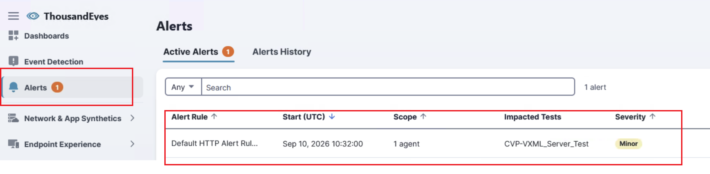

5. On the Executive Dashboard user will see the alert [ThousandEyes Permalink] along with link to call logs and ladder diagram**. [PN : DB sync happens every 15 minutes. Correlation can be seen after the sync]**


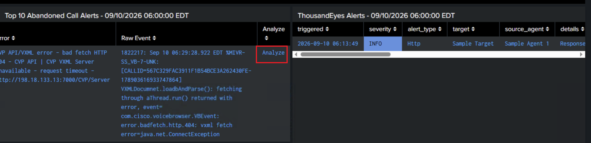

6. Clicking on Analyze will show the logs with ladder diagram.

## 11. Install the Endpoint Agent

The following sections configure ThousandEyes Endpoint Experience for Cisco Finesse Agent Desktop.

1. In ThousandEyes, go to Endpoint Experience → Agent Settings → Download.
2. Select Endpoint Agent (full featured). Endpoint Agent Pulse is not used for this design.
3. Choose Windows and x86 version for WKST1.
4. Copy the connection string from this page. You will paste it during installation, so the agent registers into the correct ThousandEyes Organization.
5. Install the package on the agent desktop and complete registration with that connection string.

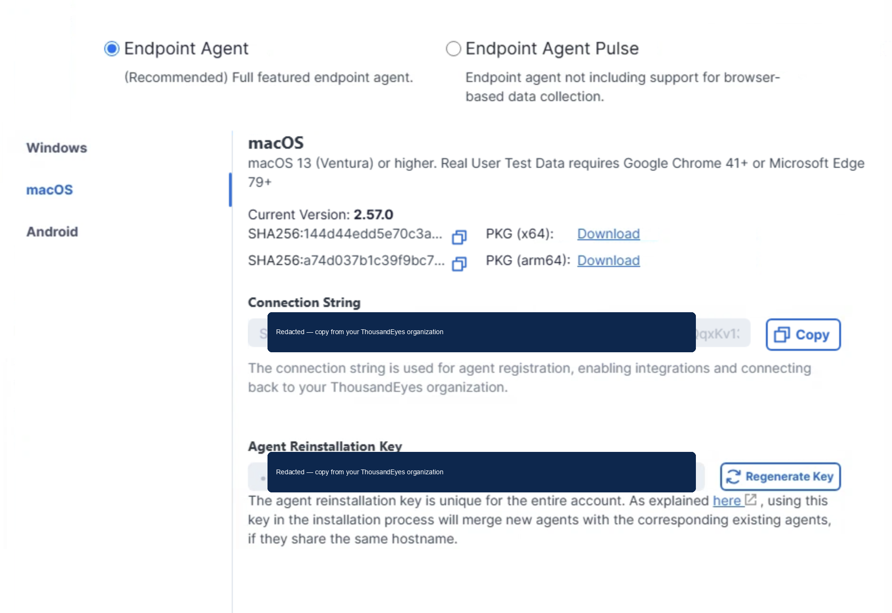

6. Return to Endpoint Experience → Agent Settings and confirm the hostname appears, the agent is Enabled, and it is checking in.

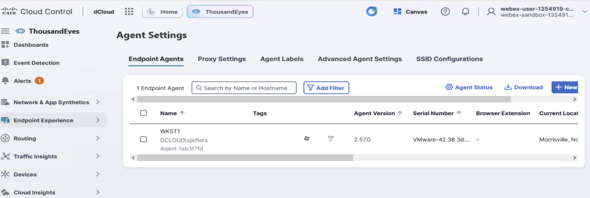

## 12. Create the Finesse scheduled network test

1. Go to Endpoint Experience → Test Settings → Synthetic Tests.
2. Click + Monitor Application.

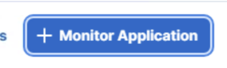

3. Choose Custom Application.
4. Set the application name. Recommended: Finesse - Scheduled - Network.
5. Under + Add Test, choose Scheduled – Network.

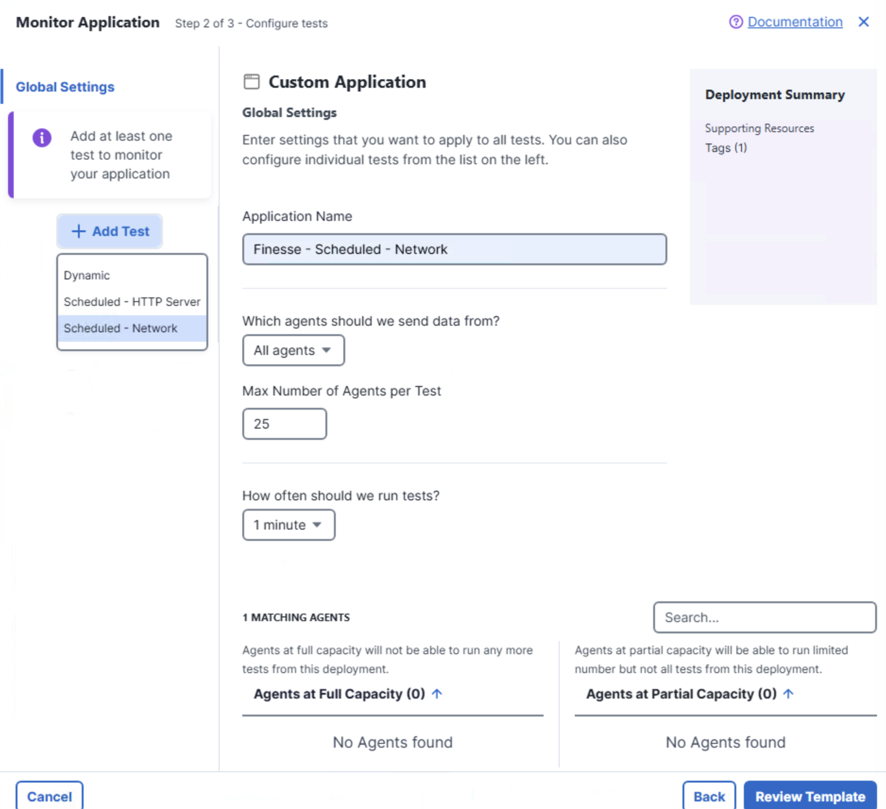

6. Set the test target to the customer Finesse FQDN : <copy>finesse1.dcloud.cisco.com</copy>
7. Change agent selection from All agents to Specific agents, then select the Endpoint Agents that should run the test.

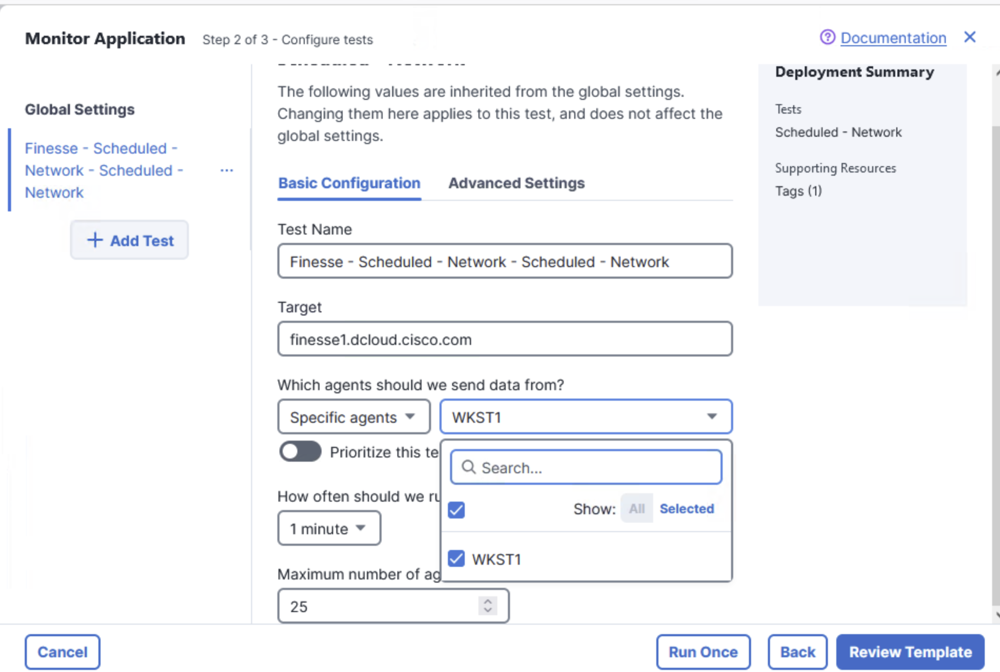

8. Click Review Template, then click on Next to Save test.
9. Edit the test to update Finesse port and protocol and Save Test,  
   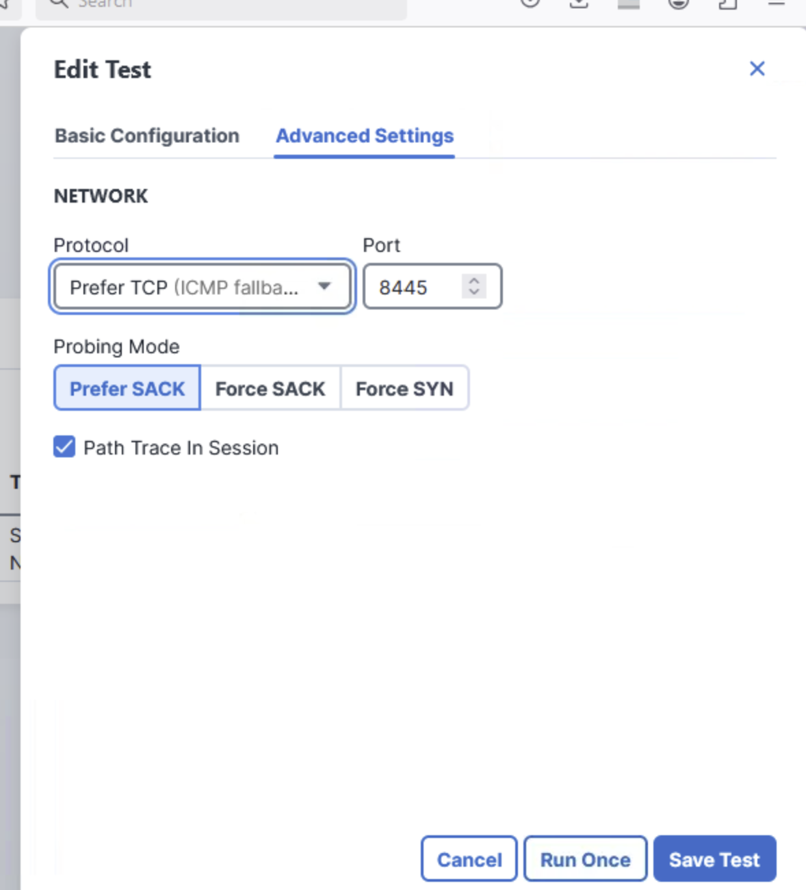
10. Select the Finesse - Scheduled - Network - Scheduled – Network test and click on Run Once.

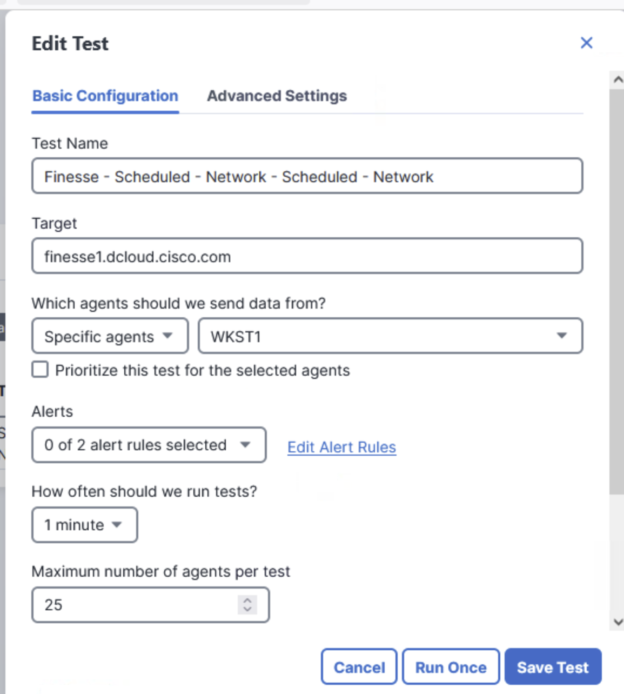

11. Check for path visualization:

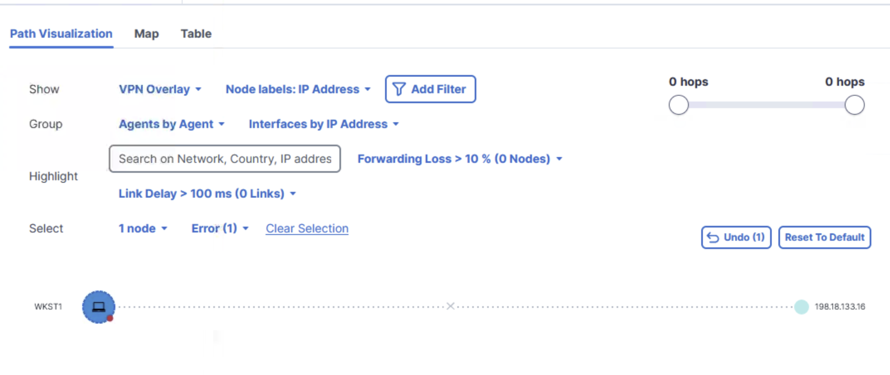

12. Attach this test to Operations already created and save. Manage → Integrations 2.0 → Operations. Select Splunk\_TE\_Operation:   
   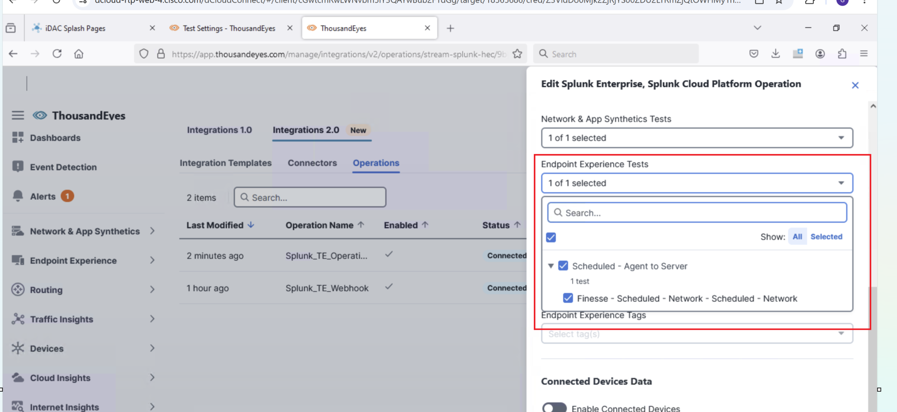
13. Simulate Network disconnect with finesse and Endpoint agent by adding invalid mapping in hosts file.  
   C:\Windows\System32\drivers\etc\hosts file. [Open as administrator]

**<copy>10.68.10.10 finesse1.dcloud.cisco.com</copy>**

14. Wait for few minutes for the test to run. Login to Splunk and click on **CCE Executive Overview** application.

You can see the Agent Experience state changed to 1 on the dashboard. Click on the card.

15. User will see Agent Experience Score details and permalink to ThousandEyes.

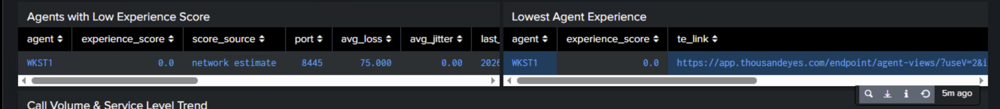

16. Click on the permalink to view the details in ThousandEyes.

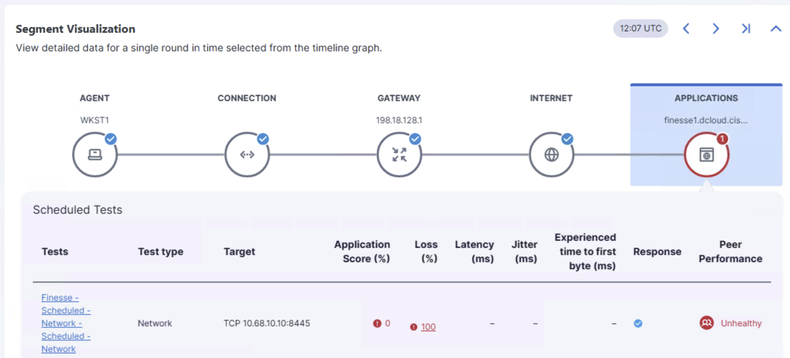

## 13. Verify ThousandEyes data in Splunk

Wait at least two test intervals (about two minutes at 1-minute frequency), then run these searches. Adjust index and time range to the customer environment.

### 13.1 Executive Dashboard to view the Correlation for the enterprise test:

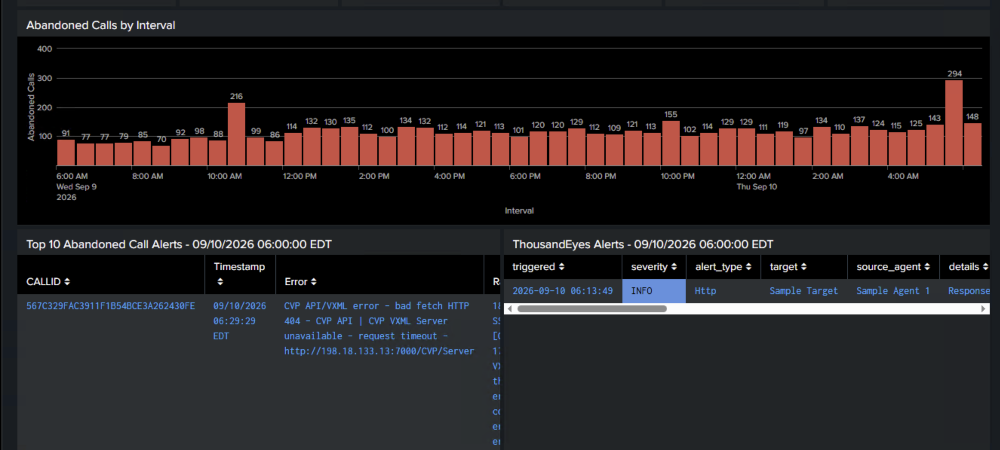


### 13.2 Confirm Endpoint Agent metrics

<copy><i>
index=\* (sourcetype=cisco:thousandeyes:metric OR sourcetype=finesse:thousandeyes:real\_user) <br>
| eval te\_agent=coalesce('thousandeyes.source.agent.name', computer\_name, 'agent.name') <br>
| eval te\_port=tostring(coalesce(dest\_port, server.port, "")) <br>
| where isnotnull(te\_agent) AND te\_agent!="" AND (te\_port="8445" OR sourcetype="finesse:thousandeyes:real\_user") <br>
| stats latest(\_time) as last\_seen, count as event\_count, <br>
max('metric\_name:network.loss') as max\_loss, <br>
max('metric\_name:network.latency') as max\_latency, <br>
max('metric\_name:network.jitter') as max\_jitter <br>
by te\_agent <br>
| eval last\_seen=strftime(last\_seen,"%Y-%m-%d %H:%M:%S") <br>
| sort - event\_count <br>
</i>
</copy>

### 13.3 Confirm ThousandEyes metric events are present in Splunk

<copy><i>
index=\* (sourcetype=cisco:thousandeyes:metric OR sourcetype=finesse:thousandeyes:real\_user) <br>
| stats count as event\_count, latest(\_time) as last\_seen, dc(coalesce('thousandeyes.source.agent.name', computer\_name, 'agent.name')) as  distinct\_agents <br>
| eval last\_seen=strftime(last\_seen,"%Y-%m-%d %H:%M:%S") </i>
</copy>

If this search returns no score fields, Splunk is receiving Agent-to-Server network gauges only. That is expected until Endpoint Experience tags and local-network streaming are enabled on the Splunk TE operation.

## 14. Sending CVP Metrics using OpenTelemetry

### 14.1 Start OTel Agent for Metrics Collection in CVP

1. Login to CVP VM from mRemote. Stop if other OTel process is running

2. Open the PowerShel. Change directory to Desktop.

3. Start the PowerShell script **start-metrics-collector.ps1**

### 14.2 View metrics in the CCE Splunk app

1. Open CCE Log Collection → Platform – UCCE Insights → CCE Infrastructure Monitoring.

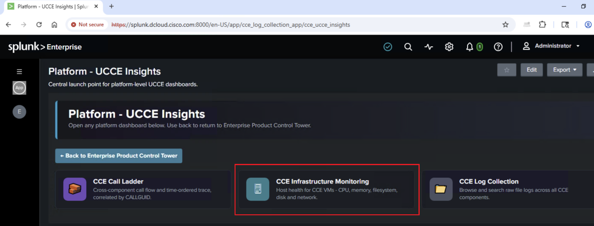

*Figure 1. Platform – UCCE Insights — CCE Infrastructure Monitoring shows host and process health from OpenTelemetry metrics.*

2. Set Component to CVP and CVP Process as required, then Submit. Confirm CallServer and VXMLServer CPU and memory panels populate.

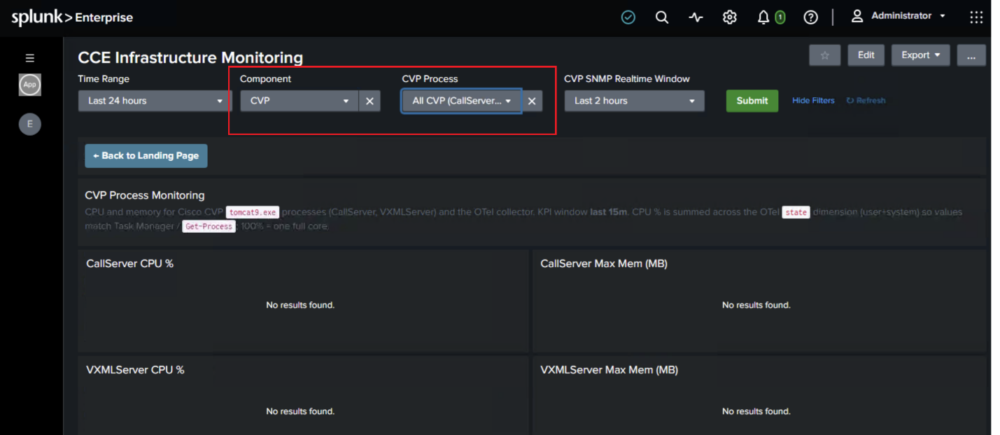

*Figure 2. CCE Infrastructure Monitoring for CVP. Empty panels usually mean the metrics collector is not running or the time range does not cover recent samples.*

## 15. Endpoint Experience alert rules

1. Open Manage → Alerts → Alert Rules → Endpoint Experience. Confirm Default Endpoint HTTP and Default Endpoint Network rules are enabled.

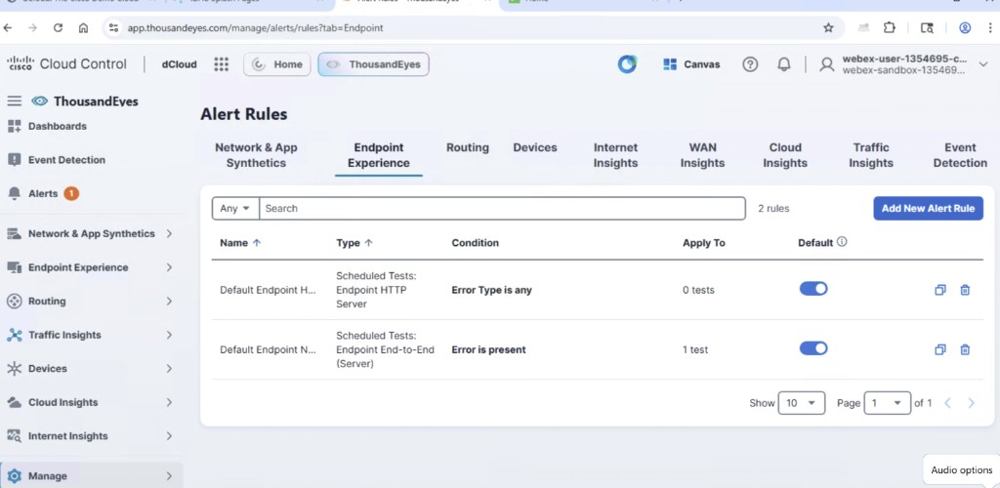

*Figure 1. Alert Rules → Endpoint Experience. Default Endpoint HTTP Server and Default Endpoint Network (End-to-End Server) rules. Assign the Finesse scheduled tests here.*

2. Open Default Endpoint Network Alert Rule. Set Agents (All agents or the specific Endpoint Agents), Tests (the Finesse scheduled network test), and Severity (Critical unless the customer specifies otherwise).

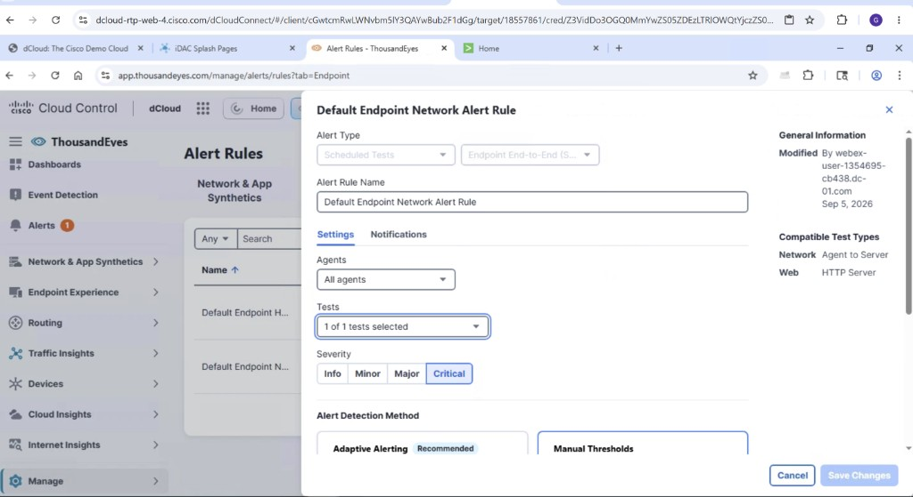

*Figure 2. Default Endpoint Network Alert Rule — Settings: Scheduled Tests, Endpoint End-to-End, All agents, tests selected, Critical. Adaptive Alerting is available; the next step uses Manual Thresholds to match Error is present.*

3. On Critical, choose Manual Thresholds. Require Error is present (at least 1 agent, 1 of 1 time in a row, or the customer’s window). Save Changes.

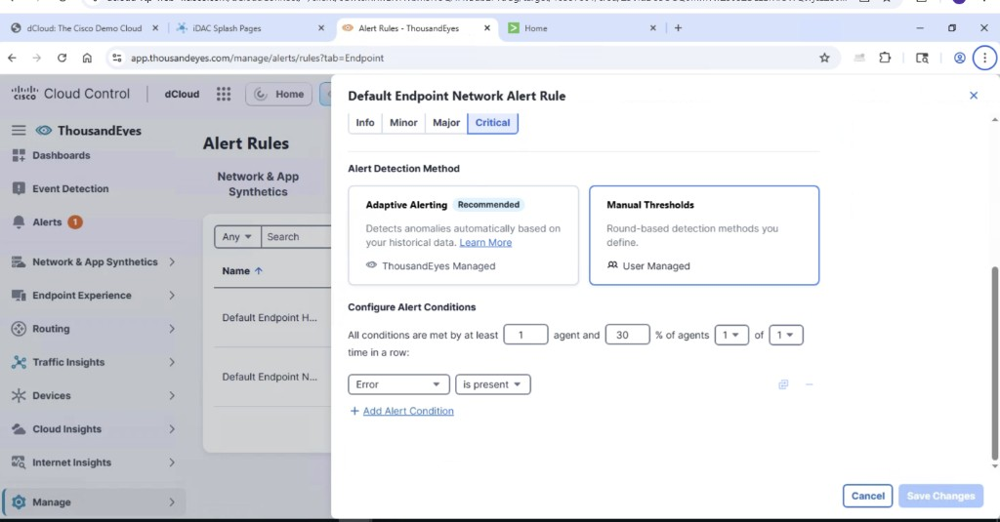

*Figure 3. Default Endpoint Network Alert Rule — Critical, Manual Thresholds, condition Error is present. Use this so Endpoint Agent path errors raise alerts.*
