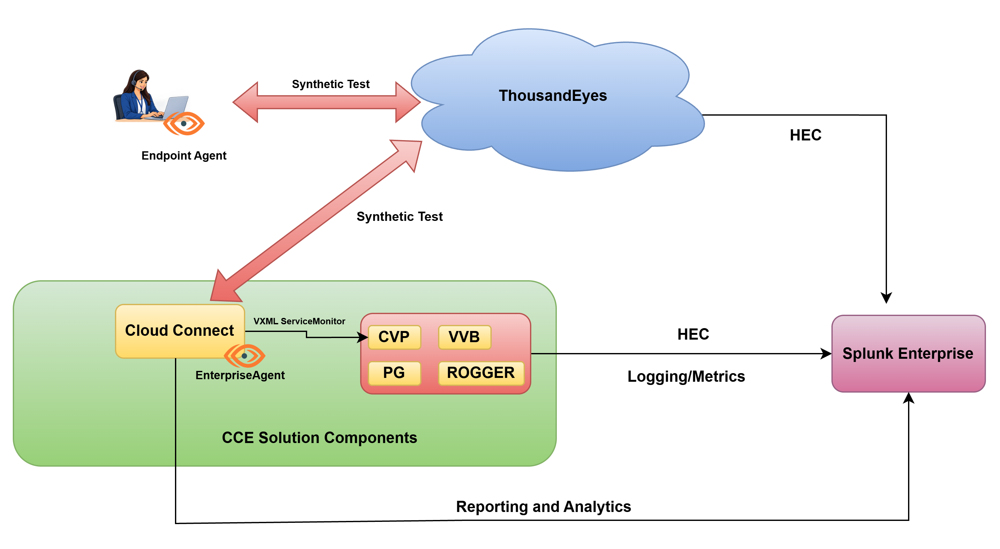
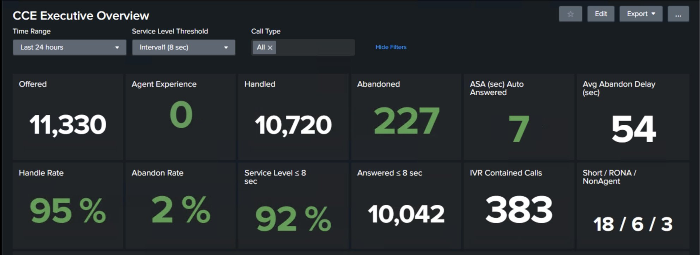
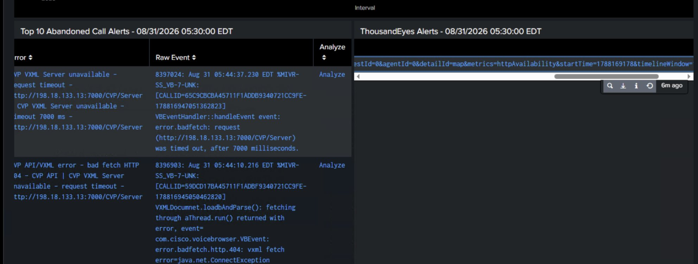
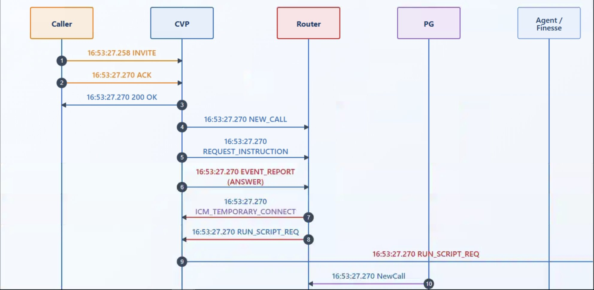
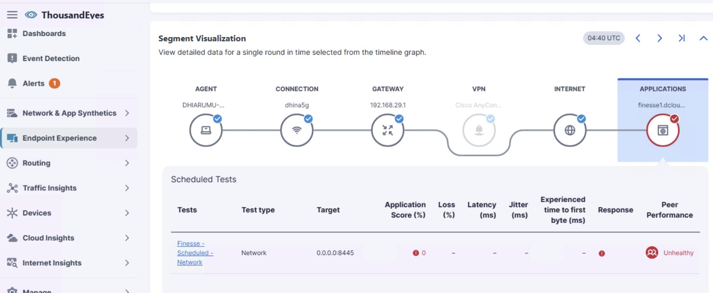

# Lab Topology and Deliverables

****

By performing this exercise, users will be able to see CCE platform logs and metrics in Splunk along with Network and Experience telemetry can be viewed in Splunk.

Custom Splunk Application is deployed to view logs and build ladder diagram for the Call Flow. It also provides Executive Dashboard to view real time data and correlating network, and experience Telemetry data from ThousandEyes. Alerts created at ThousandEyes for Synthetic tests will be pushed to Splunk.  
  
Snippet from custom dashboard:

|  |  |
| --- | --- |
| **Outcome** | **Where you see it** |
| **CCE component logs in Splunk** | Indexes cvp, pg, router, vvb — Search & Reporting or CCE Log Collection |
| **Cross-component call flow** | CCE Call Ladder dashboard, search by CALLGUID |
| **CVP host and process metrics** | Index cvp\_metrics — CCE Infrastructure Monitoring |
| **CCE real-time events over HEC** | Search & Reporting — index="cce\_rt" (last 15 minutes after flow start) |
| **Endpoint Agent and Enterprise Agent in CC registered in your ThousandEyes organization** | Endpoint Experience → Agent Settings |
| **Scheduled Agent-to-Server test against your Finesse host** | Endpoint Experience → Test Settings |
| **Application path, loss, latency, and Application Score** | Endpoint Agents → Agent Views |
| **ThousandEyes network metrics in Splunk** | Index te (or the customer index), sourcetype cisco:thousandeyes:metric |
| **ThousandEyes alerts in Splunk** | Same Splunk HEC endpoint, alert sourcetype |